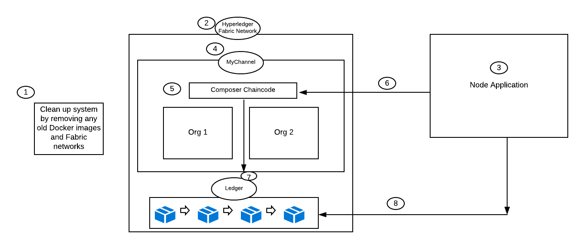
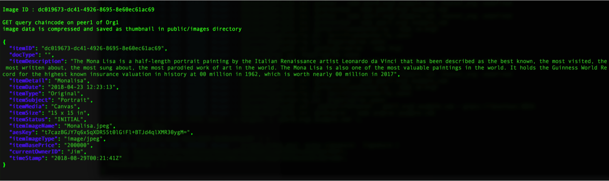

# Securing Artwork using Blockchain Digital Certificates

This code pattern is a sample auction Node.js based application that demonstrates storing base64 encoded and encrypted images on a Blockchain ledger and retrieving the same. This application launches Hyperledger Fabric network and then starts the application as a REST API server built on top of NodeSDK APIs.

**Auction Blockchain Application Credits**: Mohan Venkataraman, Sandeep Pulluru and Ratnakar Asara

**Disclaimer**: The image used in this sample demo has been downloaded from publicly available images on the internet, and the copyright belongs to the respective owners. The usage here is strictly for non-commercial purposes as sample data. We recommend that users create their own sample data as appropriate. All details used in the sample data are fictitious. The information provided in this `README.md` is subject to change. Also this is based out of fabric-sample balance-transfer example.

When the reader has completed this code pattern, he or she will understand how to:

* Set up a Blockchain network
* Generate a base64 encrypted image and store it on the blockchain ledger
* Query chaincode to retrieve image and store it in a public folder


<!--Remember to dump an image in this path-->
<p align="center">

</p>

## Flow
<!--Add new flow steps based on the architecture diagram-->
1. Teardown any existing networks, remove any existing containers or images lying around
2. Launch the Hyperledger Fabric network
3. Launch the Node.js application (Rest Server wrapper of top of the NodeSDK API)
4. Create the channel myChannel
5. Install and instantiate the auction chaincode
6. Invoke a transaction where the Node.js app transforms a base 64 encrypted image into a string format
7. Store the encrypted image image on the Blockchain ledger
8. Query ledger to get the image data by its imageID and save the image as a Thumbnail in a public folder

<!--Update this section-->
## Prerequisites
* [Docker](https://www.docker.com/): 17.09.x or higher
* [Docker Compose](https://docs.docker.com/compose/): 1.16.1 or higher
* [jq](https://stedolan.github.io/jq/)
* [Hyperledger Fabric SDK](https://fabric-sdk-node.github.io/): Enables backend to connect to IBM Blockchain service
* [Node.js packages](https://docs.docker.com/compose/): If expecting to run this application locally, please continue by installing [Node.js](https://docs.docker.com/compose/) runtime and NPM. Currently the Hyperledger Fabric SDK only appears to work with node v8.9.0+, but [is not yet supported](https://github.com/hyperledger/fabric-sdk-node#build-and-test) on node v9.0+. If your system requires newer versions of node for other projects, we'd suggest using [nvm](https://github.com/creationix/nvm) to easily switch between node versions. We did so with the following commands
```
curl -o- https://raw.githubusercontent.com/creationix/nvm/v0.33.11/install.sh | bash
# Place next three lines in ~/.bash_profile
export NVM_DIR="$HOME/.nvm"
[ -s "$NVM_DIR/nvm.sh" ] && \. "$NVM_DIR/nvm.sh"  # This loads nvm
[ -s "$NVM_DIR/bash_completion" ] && \. "$NVM_DIR/bash_completion"  # This loads nvm bash_completion
nvm install v8.9.0
nvm use 8.9.0
```

<!--Update this section-->
## Included components
* [Hyperledger Composer v0.19.4](https://hyperledger.github.io/composer/latest/) Hyperledger Composer is an extensive, open development toolset and framework to make developing blockchain applications easier
* [Hyperledger Fabric v1.1](https://hyperledger-fabric.readthedocs.io) Hyperledger Fabric is a platform for distributed ledger solutions, underpinned by a modular architecture delivering high degrees of confidentiality, resiliency, flexibility and scalability.

<!--Update this section-->
## Featured technologies
* [Hyperledger Node.js SDK](https://github.com/hyperledger/fabric-sdk-node)
* [jq](https://stedolan.github.io/jq/): a lightweight and flexible command-line JSON processor
* [Docker](https://www.docker.com/): 17.09.x or higher
* [Docker Compose](https://docs.docker.com/compose/): 1.16.1 or higher
* [Node.js](https://docs.docker.com/compose/): v8.9.0 or higher

## Steps
1. [Clone the repo](#1-clone-the-repo)
2. [Launch Hyperledger Fabric Network and Node App](#2-launch-hyperledger-fabric-network-and-node-app)
3. [Create the Network Channel and Invoke a Transaction](#3-Create-the-Network-Channel-and-Invoke-a-Transaction)


### Step 1. Clone the repo

Clone the `SecuringArt-using-Blockchain-DigitalCertificates` repo locally. In a terminal, run:

```
git clone https://github.com/IBM/SecuringArt-using-Blockchain-DigitalCertificates.git
```

### Step 2. Launch Hyperledger Fabric Network and Node App

In one terminal launch hyperledger fabric network and Node.js application (a REST Server wrapper on top of Fabric NodeSDK api) with the following command
```
cd SecuringArt-using-Blockchain-DigitalCertificates
./bootstrap_app.sh
```
The above script **bootstrap_app.sh** performs the following actions:
* remove any old *docker* images
* *Downloads* fabric images
* restarts the *Fabric network*
* *Installs* required node modules
* *Starts* the node application on Port 4000

**NOTE:** You may be tempted to run `http://localhost:4000` at this point - please do not do that; otherwise you will get an `UnauthorizedError: No authorization token was found` error.  After running the `bootstrap_app.sh` command, immediately go to [Create the Network Channel and Invoke a Transaction](#3-Create-the-Network-Channel-and-Invoke-a-Transaction) and run the `quicketest.sh` command.

### Step 3. Create the Network Channel and Invoke a Transaction
In another terminal issue the following command from auction directory.
```
./quicktest.sh
```
The above script **quicktest.sh** performs the following actions:
* creates a *channel* named **mychannel** & and all the peers on the network *join*s the channel
* *Installs* & *Instantiates* auction chaincode
* send an *Invoke transaction*. where Node.js app generates base64 encrypted image in to a string format and sends it to chaincode, then *auction chaincode* stores the image on the Blockchain ledger of the channel *mychannel*.
* Query chaincode to get the Image data using the imageID, the image will be saved as Thumbnail and saved in `public/images` folder.

You should see similar results from running `quicktest.sh`:
<p align="center">

</p>


* For all the image processing & conversion refer to the Node.js code [here](https://github.com/ChainyardLabs/auction/blob/master/app/saveImageTx.js)

* Storing an image using chaincode, refer the code snippet [here](https://github.com/ChainyardLabs/auction/blob/master/artifacts/src/github.com/auction/auction.go#L138-L168)

* Please check youtube video available here: https://goo.gl/jH1uCQ


# Links

* [IBM Blockchain - Marbles demo](https://github.com/IBM-Blockchain/marbles)
* [Hyperledger Composer](https://hyperledger.github.io/composer/latest/index.html)


# Learn more

* **Blockchain Code Patterns**: Enjoyed this Code Pattern? Check out our other [Blockchain Code Patterns](https://developer.ibm.com/code/technologies/blockchain/)

* **Blockchain 101**: Learn why IBM believes that blockchain can transform businesses, industries – and even the world. [Blockchain 101](https://developer.ibm.com/code/technologies/blockchain/)

# License
[Apache 2.0](LICENSE)
